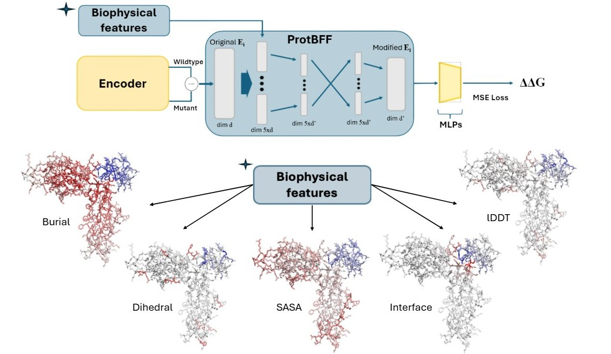

# ProtBFF

### A General Framework for Injecting Biophysical Priors into Protein Embeddings

*Feldman, Maechler, Wang & Shakhnovich — bioRxiv, 2026*

**ProtBFF** (**Prot**ein **B**iophysical **F**eature **F**ramework) is a small, encoder-agnostic
module that injects five interpretable biophysical priors into residue-level protein embeddings
through cross-embedding attention. It makes a pretrained protein language model noticeably better
at predicting how mutations change protein–protein binding affinity (ΔΔG): each residue's embedding
is scaled by structural scores so the model attends to the residues that actually matter for
binding — those at the interface, buried in the core, or whose local structure shifts on mutation.



This repository also ships an honest benchmark. The usual SKEMPI2 splits leak homology between
train and test, because many "different" complexes are near-duplicates of one another, and that
inflates every model's reported score. We include **MVA-60**, a chain-level homology-controlled
split, and evaluate on it throughout.

## Installation

```bash
git clone https://github.com/Dianzhuo-Wang/ProtBFF.git
cd ProtBFF
conda create -n protbff python=3.10 && conda activate protbff
pip install -r requirements.txt
```

## Repository layout

- `data_pipeline/` — computes the five biophysical scores, tokenizes and embeds structures, and
  assembles the model inputs (`merge_scores.py`).
- `tuning_v1/` — the model (`protbff_arch.py`), the training and benchmark drivers, and the figure
  scripts.
- `experiments/` — Modal (serverless GPU) launchers for the sweeps.
- `data/cross_validation_folds_mva/` — the MVA splits at 30–90% identity: clusters, pairwise
  similarity edges, and the ten train/test fold assignments per threshold.
- `data/cross_validation_folds_final/` — the older CD-HIT splits, kept as a baseline.
- `data/SKEMPI2_filtered_final.csv` — the 335-complex, 6,631-mutation working set.

## The MVA-60 split

Two complexes are grouped together whenever a mutated chain in one is at least 60% identical to any
chain in the other (all-versus-all MMseqs2 at the chain level), and whole groups stay on the same
side of every fold. This keeps near-duplicate complexes out of both train and test at once, which
is the leakage that inflates the standard benchmarks.

## Reproducing the benchmark

1. Compute the biophysical scores (`data_pipeline/calculate_all_scores.py`).
2. Embed the wildtype and FoldX-mutant structures with your encoder of choice.
3. Assemble a score cache with `data_pipeline/merge_scores.py`.
4. Train and evaluate on the MVA folds:

```bash
python tuning_v1/protbff_arch.py \
    --variants antisym,dual \
    --folds_dir data/cross_validation_folds_mva/60_percent \
    --clusters data/cross_validation_folds_mva/60_percent/clusters.tsv \
    --cache <your_score_cache.npz> --embed_dim <D>
```

## What's not in the repo

To keep it light, the large regenerable files are left out: FoldX mutant structures, per-residue
embeddings, and score caches (`*.npz`, `*.pt`). The ProSST structure-quantizer weights (`*.joblib`)
come from the ProSST release (AI4Protein/ProSST). A few scripts carry cluster-specific paths, so
adjust those for your setup.

## Citation

```bibtex
@article{Feldman2025.12.23.696257,
    author  = {Feldman, Jonathan and Maechler, Antoine and Wang, Dianzhuo and Shakhnovich, Eugene},
    title   = {A General Framework for Injecting Biophysical Priors into Protein Embeddings},
    year    = {2026},
    doi     = {10.64898/2025.12.23.696257},
    journal = {bioRxiv},
    publisher = {Cold Spring Harbor Laboratory},
    URL     = {https://www.biorxiv.org/content/early/2026/02/23/2025.12.23.696257}
}
```
